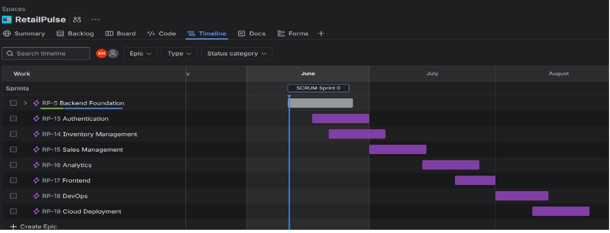

# RetailPulse 🛍️

A full-stack retail management system built with FastAPI, PostgreSQL and React, 
managed using Agile/Scrum methodology.

## 🚀 Tech Stack

**Backend**
- FastAPI
- PostgreSQL
- SQLAlchemy (ORM)
- Pydantic (validation)
- JWT Authentication

**Frontend** (Sprint 3)
- React
- Chart.js
- Tailwind CSS

**DevOps** (Sprint 4)
- Docker
- GitHub Actions CI/CD
- AWS (EC2, RDS, S3)

## 📊 Project Management (Jira)

This project is managed using Agile/Scrum methodology with 4 sprints 
planned from June to August 2026.

### Sprint Roadmap


| Sprint | Focus | Dates | Status |
|--------|-------|-------|--------|
| Sprint 0 | Backend Foundation | Jun 11-24 | ✅ Complete |
| Sprint 1 | Authentication | Jun 11-24 | 🔄 In Progress |
| Sprint 2 | Inventory + Sales | Jun 25-Jul 8 | ⬜ Planned |
| Sprint 3 | Analytics + Frontend | Jul 9-22 | ⬜ Planned |
| Sprint 4 | DevOps + Deployment | Jul 23-Aug 5 | ⬜ Planned |

## ✨ Features

**Sprint 0 - Completed**
- FastAPI project setup
- PostgreSQL database configuration
- SQLAlchemy ORM models
- Product CRUD APIs
- Pydantic validation schemas

**Sprint 1 - In Progress**
- User registration and login
- Password hashing (bcrypt)
- JWT token generation
- Role-based authorization
- Protected routes

**Sprint 2 - Planned**
- Inventory tracking
- Stock adjustments
- Low stock alerts
- Sales management
- Revenue calculations

**Sprint 3 - Planned**
- Analytics dashboard
- Revenue charts
- Product performance metrics
- React frontend

**Sprint 4 - Planned**
- Docker containerization
- GitHub Actions CI/CD
- AWS deployment
- Monitoring and logging

## ⚙️ Local Setup

**1. Clone the repository**
```bash
git clone https://github.com/KhizraHanif/RetailPulse.git
cd RetailPulse
```

**2. Create virtual environment**
```bash
python -m venv venv
venv\Scripts\activate
```

**3. Install dependencies**
```bash
pip install -r requirements.txt
```

**4. Set up environment variables**
```bash
cp .env.example .env
# Edit .env with your database credentials
```

**5. Run the application**
```bash
cd backend
uvicorn main:app --reload
```

**6. Access API docs**
