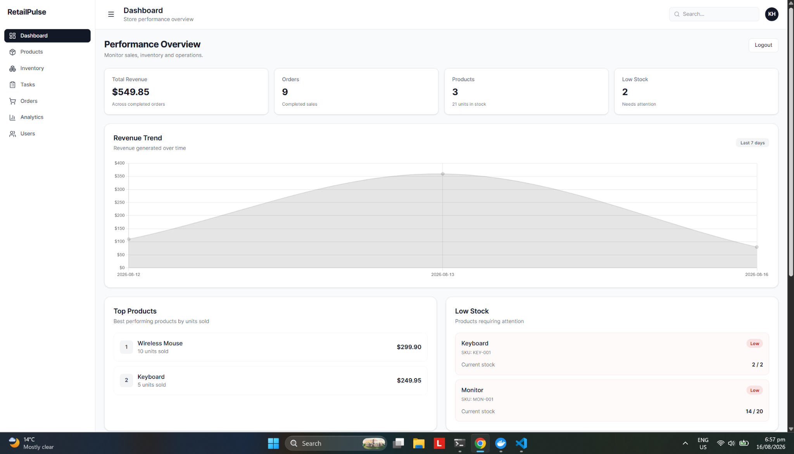
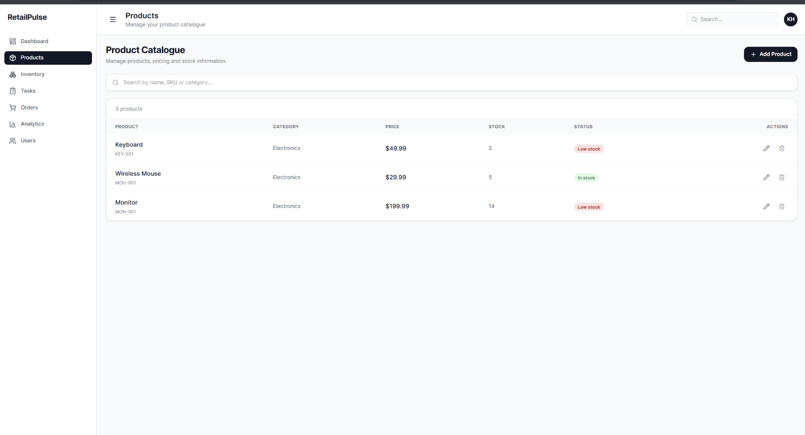
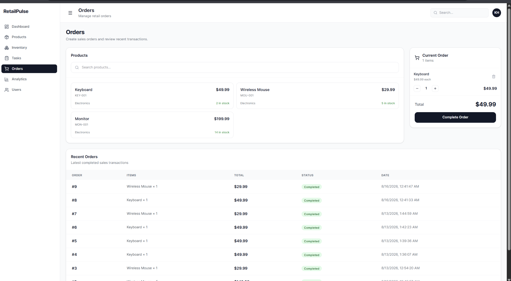
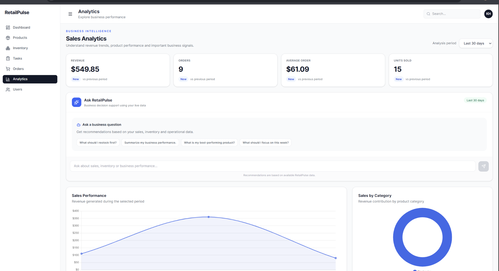
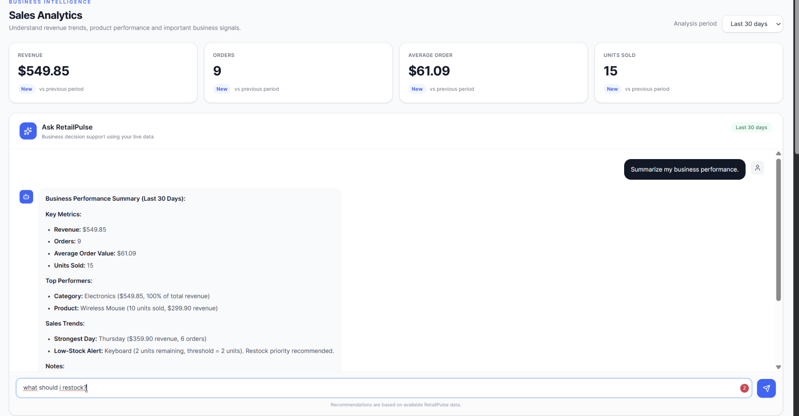

# RetailPulse

**Retail operations, analytics, and decision-support platform built with FastAPI, React, PostgreSQL, Redis, Celery, RabbitMQ, LangChain, and Ollama.**

RetailPulse is a full-stack retail management platform that combines product management, inventory tracking, sales order processing, warehouse operations, business analytics, and evidence-backed decision support in one application.

The project is developed incrementally using an Agile/Scrum workflow and is currently complete as a local MVP. Automated testing, CI/CD, and cloud deployment are planned as the next production-readiness stages.

---

## Application Demo

### Dashboard



The dashboard provides an operational overview of the store, including:

- total revenue
- completed orders
- product count
- low-stock products
- revenue trends
- top-selling products
- inventory alerts

Dashboard summary data is served through FastAPI and cached in Redis to reduce repeated aggregate queries against PostgreSQL.

---

### Product Management



RetailPulse provides product catalogue management with:

- product name
- SKU
- category
- price
- quantity
- low-stock threshold
- stock status

Product CRUD operations are handled through FastAPI service and router layers, with PostgreSQL acting as the persistent source of truth.

---

### Inventory Management


Inventory can be increased or reduced while recording the reason for each stock change.

Each adjustment creates an inventory movement, providing an audit history for:

- sales
- restocking
- manual adjustments
- damaged inventory
- other stock changes

The backend prevents invalid stock operations and keeps inventory changes consistent with the database.

---

### Warehouse Task Management


Owners and managers can create warehouse tasks and assign them to warehouse staff.

Tasks support operational workflows such as:

- restocking
- stock checks
- inventory handling
- warehouse assignments

Warehouse staff only see their assigned tasks and can update task status as work progresses.

Role permissions are enforced by the FastAPI backend rather than relying only on frontend visibility.

---

### Sales and Order Processing



The Orders interface allows authorised users to create retail sales using current product and stock data.

The backend:

- validates products
- validates available stock
- calculates prices and totals server-side
- creates orders and order items
- reduces inventory
- records inventory movements
- commits the transaction atomically
- invalidates stale dashboard cache data
- triggers low-stock background processing

---

### Sales Analytics



The analytics workspace provides deeper business performance analysis beyond the operational dashboard.

Current analytics include:

- revenue
- completed orders
- average order value
- units sold
- revenue trends
- sales by category
- product performance
- sales by weekday
- business signals
- comparison with previous periods

Users can switch between different analysis periods directly from the interface.

---

### Ask RetailPulse — Decision Support



RetailPulse includes a LangChain-powered decision-support assistant that combines sales, inventory, and operational data to generate evidence-backed recommendations.

Users can ask questions such as:

- What should I restock first?
- Summarize my business performance.
- What is my best-performing product?
- Which products need attention?
- How busy are warehouse operations?
- What should I focus on this week?
- Show my all-time business performance.

The assistant does not receive unrestricted database access.

Instead, LangChain selects controlled RetailPulse tools that call existing application services.

```text
Business Question
        |
        v
FastAPI Assistant Endpoint
        |
        v
LangChain Agent
        |
        +----------------------------+
        |             |              |
        v             v              v
 Sales Analytics   Inventory     Operations
      Tool            Tool           Tool
        \             |             /
         \            |            /
          +-----------+-----------+
                      |
                      v
                 PostgreSQL
                      |
                      v
          Evidence-backed response
```

PostgreSQL and RetailPulse business rules remain the source of truth.

The assistant currently runs locally using **Ollama with Qwen3 8B**, allowing local model execution without per-request API costs.

---

# Architecture

```text
                              RetailPulse
                                   |
             +---------------------+---------------------+
             |                                           |
             v                                           v
      React + TypeScript                           FastAPI API
                                                         |
                 +----------------------+----------------+----------------+
                 |                      |                                 |
                 v                      v                                 v
            PostgreSQL                Redis                           LangChain
                 |                      |                                 |
                 |                Dashboard Cache                         v
                 |                                                    Ollama
                 |                                                       |
                 |                                                    Qwen3 8B
                 |
                 +----------------------+
                                        |
                                        v
                                      Celery
                                        |
                                        v
                                    RabbitMQ
```

---

## PostgreSQL

PostgreSQL stores persistent application data including:

- users
- products
- orders
- order items
- inventory movements
- inventory tasks

SQLAlchemy is used for ORM access and Alembic manages database schema migrations.

---

## Redis Caching

RetailPulse uses Redis with a **cache-aside strategy** for dashboard summaries.

```text
Dashboard Request
       |
       v
     Redis
    /     \
  HIT     MISS
   |        |
Return    PostgreSQL
            |
            v
      Calculate Summary
            |
            v
       Store in Redis
            |
            v
          Return
```

When cached data exists, the API can return it without repeating aggregate PostgreSQL queries.

When an order changes sales or inventory data, the relevant Redis cache is invalidated so the next request retrieves fresh values.

---

## RabbitMQ + Celery

RetailPulse uses RabbitMQ as the message broker for Celery background processing.

The current asynchronous workflow handles low-stock processing after successful sales transactions.

```text
Successful Order
      |
      v
Commit PostgreSQL Transaction
      |
      v
Check Low-Stock Conditions
      |
      v
Send Background Task
      |
      v
RabbitMQ
      |
      v
Celery Worker
      |
      v
Process Low-Stock Event
```

This keeps background work outside the HTTP request cycle.

---

# Tech Stack

| Area | Technologies |
|---|---|
| Frontend | React, TypeScript, Vite, Tailwind CSS, Chart.js |
| Backend | Python, FastAPI, Pydantic |
| Database | PostgreSQL, SQLAlchemy, Alembic |
| Authentication | JWT, bcrypt |
| Caching | Redis |
| Background Processing | Celery, RabbitMQ |
| Decision Support | LangChain, Ollama, Qwen3 8B |
| Infrastructure | Docker, Docker Compose |
| Project Management | Jira |
| Planned Deployment | AWS |
| Planned CI/CD | GitHub Actions |

---

# Features

## Authentication and Authorization

- user authentication
- password hashing
- JWT access tokens
- protected API routes
- backend role-based access control
- owner, manager, warehouse staff, and cashier roles

### Current Roles

| Role | Access |
|---|---|
| Owner | Full application access and user management |
| Manager | Orders, inventory, tasks, analytics, and operations |
| Warehouse Staff | Assigned warehouse tasks and task status updates |
| Cashier | Sales order workflow |

Sensitive permissions are enforced on the backend.

---

## Product and Inventory Management

- create, read, update, and delete products
- SKU support
- product categories
- pricing
- quantity tracking
- configurable low-stock thresholds
- stock adjustments
- prevention of invalid negative inventory
- inventory movement history
- warehouse task assignment

---

## Sales and Orders

- create retail orders
- multiple order items per order
- product validation
- stock availability validation
- server-side total calculation
- automatic inventory reduction
- inventory movement creation
- transaction rollback on database failure
- completed order history

---

## Dashboard

The dashboard provides an operational snapshot of:

- total revenue
- completed orders
- total products
- total stock
- low-stock products
- top-selling products
- revenue trends
- recent inventory activity

Dashboard summaries use Redis caching with cache invalidation after relevant business writes.

---

## Analytics

RetailPulse includes business analytics for:

- sales revenue
- order volume
- average order value
- units sold
- revenue trends
- product performance
- category performance
- weekday performance
- low-stock signals
- previous-period comparisons

The analytics interface supports multiple analysis periods.

---

## Decision-Support Assistant

The decision-support assistant combines data from:

```text
Sales
  +
Inventory
  +
Operations
  |
  v
LangChain Tools
  |
  v
Local Language Model
  |
  v
Business Recommendation
```

Example recommendations include:

- restock priorities
- product performance insights
- revenue summaries
- operational workload summaries
- inventory risks
- business performance explanations

The model accesses business data through controlled application tools rather than arbitrary SQL generation.

---

# Order Processing Flow

```text
Create Order Request
        |
        v
Authenticate User
        |
        v
Check User Role
        |
        v
Validate Products
        |
        v
Validate Available Stock
        |
        v
Calculate Server-Side Totals
        |
        v
Create Order + Order Items
        |
        v
Reduce Product Stock
        |
        v
Record Inventory Movements
        |
        v
Commit PostgreSQL Transaction
        |
        +----------------------+
        |                      |
        v                      v
Invalidate Redis       Check Low-Stock
Dashboard Cache              Threshold
                               |
                               v
                            Celery
                               |
                               v
                           RabbitMQ
                               |
                               v
                         Celery Worker
```

---

# Database Migrations

Database schema changes are managed using Alembic.

Apply all migrations:

```bash
alembic upgrade head
```

Check the current migration:

```bash
alembic current
```

The application does not create database tables automatically at startup.

Schema changes are managed through Alembic migrations.

---

# Project Structure

```text
RetailPulse/
│
├── backend/
│   │
│   ├── Dockerfile
│   ├── requirements.txt
│   ├── alembic.ini
│   ├── alembic/
│   │
│   └── app/
│       ├── assistant/
│       ├── core/
│       ├── database/
│       ├── models/
│       ├── routers/
│       ├── schemas/
│       ├── services/
│       └── tasks/
│
├── frontend/
│   │
│   ├── src/
│   │   ├── components/
│   │   ├── pages/
│   │   └── services/
│   │
│   └── package.json
│
├── docs/
│   ├── dashboard.png
│   ├── products.png
│   ├── inventory.png
│   ├── assigned-tasks.png
│   ├── create-orders.png
│   ├── analytics.png
│   ├── langchain.png
│   └── jira-timeline.png
│
├── docker-compose.yml
└── README.md
```

---

# Local Development

## Prerequisites

- Python 3.12+
- Node.js
- PostgreSQL
- Docker Desktop
- Ollama

---

## 1. Clone the repository

```bash
git clone https://github.com/KhizraHanif/RetailPulse.git
cd RetailPulse
```

---

## 2. Create the backend virtual environment

```bash
cd backend
python -m venv venv
```

Windows PowerShell:

```powershell
.\venv\Scripts\Activate.ps1
```

---

## 3. Install backend dependencies

```bash
python -m pip install -r requirements.txt
```

---

## 4. Configure environment variables

Create:

```text
backend/.env
```

Configure the required:

- PostgreSQL connection
- JWT settings
- Redis connection
- RabbitMQ connection
- Celery configuration

Do not commit `.env`.

---

## 5. Apply database migrations

```bash
alembic upgrade head
```

---

## 6. Start infrastructure services

From the project root:

```bash
docker compose --env-file backend/.env up -d
```

The current Docker Compose environment runs:

- Redis
- RabbitMQ
- Celery worker

---

## 7. Start FastAPI

From `backend/`:

```bash
python -m uvicorn app.main:app --reload
```

Swagger API documentation:

```text
http://127.0.0.1:8000/docs
```

---

## 8. Start the React frontend

Open another terminal:

```bash
cd frontend
npm install
npm run dev
```

Frontend:

```text
http://localhost:5173
```

---

## 9. Start the local model

Make sure Ollama is running:

```bash
ollama serve
```

Download the current model if required:

```bash
ollama pull qwen3:8b
```

The RetailPulse assistant connects to the local Ollama server through LangChain.

---

# Development Status

| Stage | Focus | Status |
|---|---|---|
| Backend Foundation | FastAPI, PostgreSQL, SQLAlchemy, Alembic | Complete |
| Authentication | JWT and role-based access | Complete |
| Product Management | Product catalogue and CRUD | Complete |
| Inventory | Stock tracking, thresholds, movements | Complete |
| Warehouse Tasks | Assignment and task status workflow | Complete |
| Sales | Orders, order items, stock updates | Complete |
| Background Processing | RabbitMQ and Celery | Complete |
| Caching | Redis cache-aside and invalidation | Complete |
| Dashboard | Operational dashboard | Complete |
| Analytics | Sales and inventory analytics | Complete for MVP |
| Frontend | React application | Complete for MVP |
| Decision-Support Assistant | LangChain + Ollama integration | Working MVP |
| Automated Testing | Backend and integration tests | Planned |
| CI/CD | GitHub Actions | Planned |
| Cloud Deployment | AWS | Planned |

---

# Engineering Highlights

### Transactional Order Processing

RetailPulse validates products and inventory, creates order records, updates stock, records inventory movements, and commits those changes within the same business transaction.

### Redis Cache-Aside Strategy

Frequently requested dashboard aggregates are cached in Redis, reducing unnecessary database work.

Relevant writes invalidate the cached summary so stale business data is not reused.

### Asynchronous Background Processing

Celery and RabbitMQ move low-stock processing outside the API request lifecycle.

### Backend Authorization

Business permissions are enforced in FastAPI rather than relying only on hidden frontend controls.

### Controlled Decision Support

LangChain exposes defined RetailPulse tools to the local model.

The model receives structured business results instead of unrestricted database access.

### Full-Stack Analytics

React visualizes PostgreSQL business data through KPIs, trends, category analysis, product performance, weekday performance, and business signals.

---

# Roadmap

The next phase focuses on production readiness rather than adding unnecessary application scope:

- automated backend tests
- API integration tests
- GitHub Actions CI/CD
- production environment configuration
- AWS deployment
- public application demo
- additional realistic demo data

---

# Project Management

RetailPulse has been developed incrementally using Jira with work divided across backend, authentication, inventory, sales, analytics, infrastructure, frontend, and deployment milestones.


---

# Author

**Khizra Hanif**

MSc Computer Science  
University of Victoria
